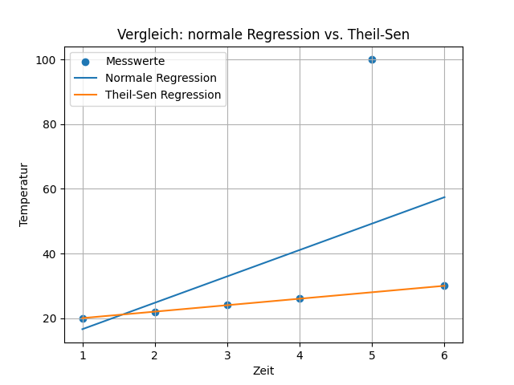

## Warum robuste Regression?

- Lineare Regression ist empfindlich gegenüber Ausreißern
- In vielen Anwendungen (Messfehler, Sensoren, Ökonomie, Umwelt) sind Ausreißer unvermeidbar; man braucht Verfahren, die trotzdem verlässliche Trends liefern.
- Robuste Regression minimiert den Einfluss von Ausreißern

## Grundidee des Theil‑Sen‑Schätzers

- Theil‑Sen ist ein Verfahren für einfache lineare Regression y = a + b*x
- Berechnet die Steigung b als Median aller Paarweise-Steigungen zwischen Punkten
- Der Achsenabschnitt a wird so gewählt, dass die Anpassungslinie ungefähr gleich viele Punkte oberhalb und unterhalb hat

## Algorithmus in 5 Schritten

1. Alle Punktepaaren \((i,j)\) mit \(i < j\) und \(x_i \neq x_j\) bilden.
2. Für jedes Paar die Steigung \(s_{ij}\) berechnen.
3. Median aller \(s_{ij}\) als Steigung \(\hat{b}\) wählen.
4. Für jeden Punkt \(a_i = y_i - \hat{b} x_i\) berechnen.
5. Median der \(a_i\) als Achsenabschnitt \(\hat{a}\) wählen.

---

## Mini-Beispiel

Datensätze:

- \((1, 2)\)
- \((2, 3)\)
- \((3, 100)\)  (klarer Ausreißer)
- \((4, 5)\)

Intuition:

- OLS wird stark in Richtung des Ausreißers \((3, 100)\) gezogen.
- Theil-Sen basiert auf Medianen und ist deutlich stabiler.

---

## Anwendungszenarien

- Umweltwissenschaften: z.B. Temperaturtrends mit Messfehlern
- Ökonomie: z.B. Einkommensdaten mit extremen Werten
- Medizin: z.B. Regressionsanalyse mit fehlerhaften Messungen

---

## Demoprojekt

```{.python}
import numpy as np
import matplotlib.pyplot as plt
from sklearn.linear_model import LinearRegression, TheilSenRegressor

x = np.array([1, 2, 3, 4, 5, 6]).reshape(-1, 1)
y = np.array([20, 22, 24, 26, 100, 30])


lin_reg = LinearRegression()
lin_reg.fit(x, y)
y_lin = lin_reg.predict(x)


theil_sen = TheilSenRegressor(random_state=42)
theil_sen.fit(x, y)
y_theil = theil_sen.predict(x)

# Ausgabe der Gleichungen
print("Normale Regression:")
print(f"Steigung: {lin_reg.coef_[0]:.2f}")
print(f"Achsenabschnitt: {lin_reg.intercept_:.2f}")

print("\nTheil-Sen Regression:")
print(f"Steigung: {theil_sen.coef_[0]:.2f}")
print(f"Achsenabschnitt: {theil_sen.intercept_:.2f}")

# Plot
plt.scatter(x, y, label="Messwerte")
plt.plot(x, y_lin, label="Normale Regression")
plt.plot(x, y_theil, label="Theil-Sen Regression")
plt.xlabel("Zeit")
plt.ylabel("Temperatur")
plt.title("Vergleich: normale Regression vs. Theil-Sen")
plt.legend()
plt.grid(True)
plt.show()
```

---

## Ergebnis

{width=300}